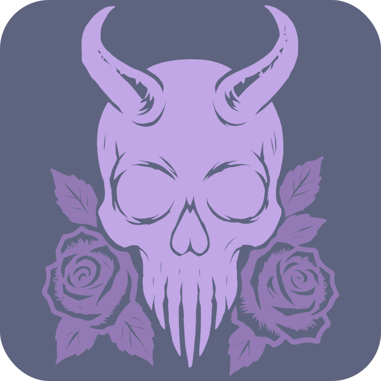
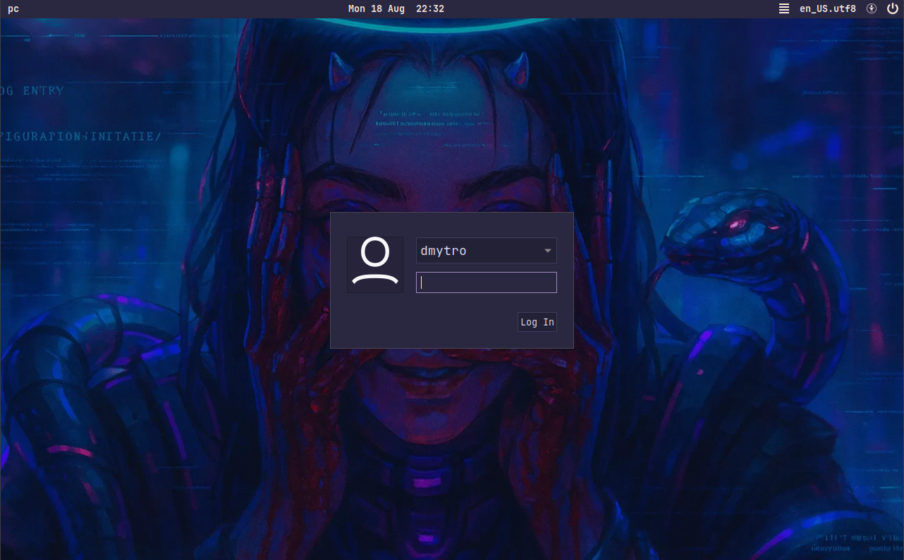

## About

 

 - OS: [**Arch**](https://www.google.com/search?q=Arch)
 - WM: [**BSPWM**](https://www.google.com/search?q=bspwm)
 - Bar: [**Polybar**](https://www.google.com/search?q=Polybar)
 - Compositor: [**Picom**](https://www.google.com/search?q=Picom)
 - Terminal: [**Alacritty**](https://www.google.com/search?q=alacritty)
 - App Launcher: [**Rofi**](https://www.google.com/search?q=Rofi)
 - Shell: [**Zsh**](https://www.google.com/search?q=Zsh)
 - Display manager: [**LightDM**](https://www.google.com/search?q=LightDM)

 

<!-- -------------------------------------------------------- -->

## Theme

    
    <h3> DEUS pink </h3>

https://github.com/user-attachments/assets/78ee8aa9-d0bf-4150-8719-513f02e49b7a

<!-- -------------------------------------------------------- -->

## What's New

### Unique themes

Fresh designs crafted specifically for this project.

Legacy support - compatibility with the original repository’s classic themes.

### Display manager support

The display manager was integrated into the initial installer with a unique configuration and extended features. Instead of using the default login theme, a custom non-standard theme is applied. Additionally, support for setting a separate background image on the login screen has been added.

<!-- -------------------------------------------------------- -->