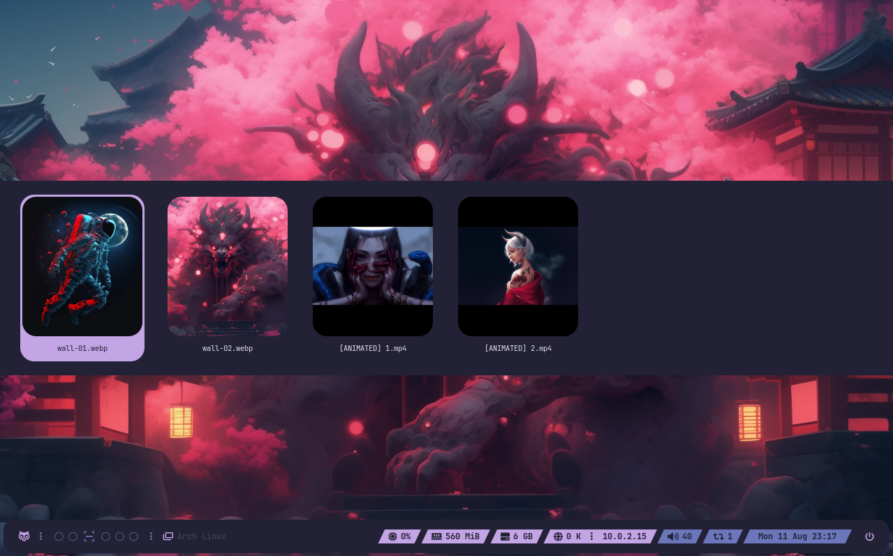

<h1 align="center">DEUS version</h1>

<!-- INFORMATION -->
<h1 align="left">About</h1>

 

 - OS: [**Arch**](https://archlinux.org/)
 - WM: [**BSPWM**](https://github.com/baskerville/bspwm)
 - Bar: [**Polybar**](https://github.com/polybar/polybar)
 - Compositor: [**Picom**](https://github.com/yshui/picom)
 - Terminal: [**Alerkitty**](https://github.com/alacritty/alacritty)
 - App Launcher: [**Rofi**](https://github.com/davatorium/rofi)
 - Shell: [**Zsh**](https://wiki.archlinux.org/title/Zsh)

 

<!-- THEME PINK -->
<h1 align="left">Theme</h1>

    
    <h3> DEUS pink </h3>

https://github.com/user-attachments/assets/7e5627eb-b1e5-4354-bab1-319a2f35ef48

<!-- WHAT'S NEW -->
<h1 align="left">What's New</h1>

 
 

- **Enhanced Wallpaper Selector**: Added support for animated wallpapers (mp4, mkv, gif) alongside static wallpapers
- **Improved Preview System**: Static wallpapers now display reliably without complex caching
- **Simplified Dependencies**: Removed imagemagick dependency for better stability
- **Random Animated Wallpapers**: Added function to randomly select animated wallpapers from `~/animated_wallpapers/`
- **Better Integration**: Seamless switching between static and animated wallpapers

 

<!-- ORIGINAL AUTHOR -->
<h1 align="left">Original author</h1>

 

- Thanks for the great std version
- Not everything suits me
- So I decided to make my own version
- Original project author:
- gh0stzk
- Github: gh0stzk/dotfiles

 