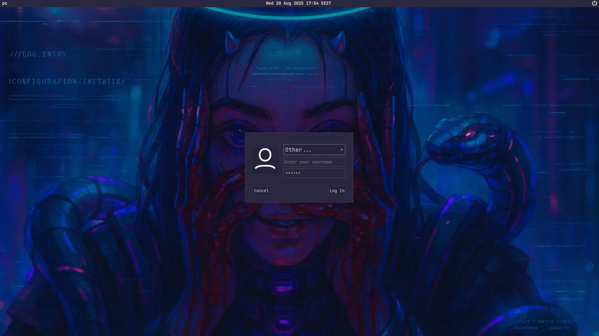

## About

 

 - OS: [**Arch**](https://www.google.com/search?q=Arch)
 - WM: [**BSPWM**](https://www.google.com/search?q=bspwm)
 - Bar: [**Polybar**](https://www.google.com/search?q=Polybar)
 - Compositor: [**Picom**](https://www.google.com/search?q=Picom)
 - Terminal: [**Alacritty**](https://www.google.com/search?q=alacritty)
 - App Launcher: [**Rofi**](https://www.google.com/search?q=Rofi)
 - Shell: [**Zsh**](https://www.google.com/search?q=Zsh)
 - Display manager: [**LightDM**](https://www.google.com/search?q=LightDM)

 

<!-- -------------------------------------------------------- -->

## Theme

    
    <h3> DEUS pink </h3>

https://github.com/user-attachments/assets/955efdf5-6147-410b-b1b0-8f0b631dcfce

<!-- -------------------------------------------------------- -->

## What's New

### Unique themes

Fresh designs crafted specifically for this project.

Legacy support - compatibility with the original repository’s classic themes.

### Display manager support

Custom LightDM integration - added directly into the initial installer.

Unique configuration - not a default setup, but tailored with extended features.

Non-standard theme - a distinctive login theme instead of the stock one.

Background support - ability to use a separate background image for the login screen.

### Wallpaper selection

The wallpaper system has been redesigned with a more flexible logic.

Quick access — the main wallpaper picker is now available with the key combination `Super + Alt + W`.

Logo priority — if the `walls` folder of the current theme contains an image or video named logo, it will always be used as the default background on each login.

Lockscreen separation — any file named lockscreen will be excluded from desktop wallpaper selection and used exclusively as the LightDM background.

Randomized choice — without a logo, a random wallpaper will be chosen each time you log in. If there’s no lockscreen, LightDM will also use a random wallpaper.

A detailed explanation of the system’s operation will be presented below:

<!-- -------------------------------------------------------- -->